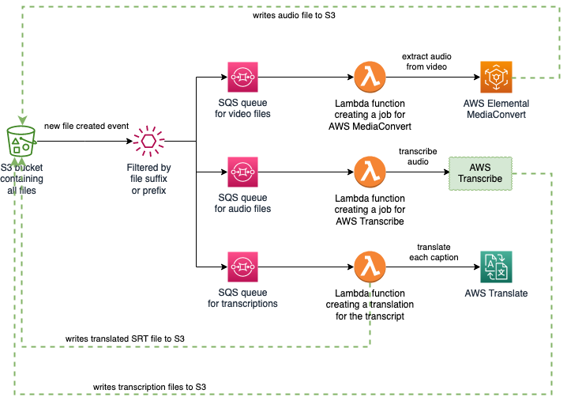

# anime-subtitle-generator 

This is a prototype of a cloud native and serverless app which transcribes anime and translates the resulting SRT files.

  

## Requirements
* AWS account
* AWS cli
* Terraform
* System that allows to run bash scripts

## Usage

**Note!**: The setup uses lokal terraform backend.

+ Authenticate to your AWS account in your CLI
+ Move to `infrastructure` folder
+ Run `terraform init`
+ Run `terraform apply`
+ You'll be asked in which AWS region you want to deploy. Enter your preferred region. Example: `us-east-2`
+ Wait for the plan to finish and then answer with `yes`.
+ Create a folder `video` in the newly created S3 bucket prefixed with `anime-subtitle-generator` and place an `*.mkv` file in it.
+ If everything worked fine then there will be a translated `*.srt` file in the folder `translations` of the same bucket.

## Notes
The quality isn't that good. I guess that there are better software solutions for both the transcription as well as
the translation compared to the AWS managed services. It was fun to set this up anyway.

Another step could be to automatically commit the SRT files (both transcription and translation) to a git repo and
improve the files with multiple contributors.